# Aquarium monitor

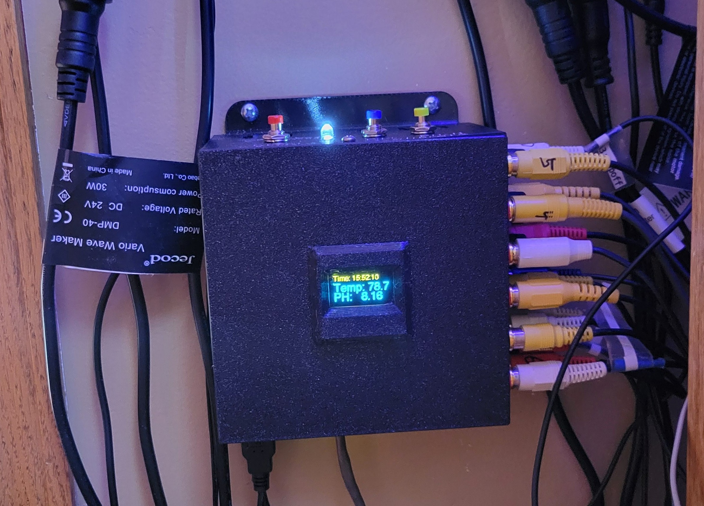

Python-based aquarium monitor program running under the Raspberry Pi OS Lite Linux operating system on a Raspberry Pi 4 board. A Adafruit Perma-Proto Hat is mounted on the board to house two MCP3008 10-bit ADC with SPI interface. This provides the analog inputs to the monitor. The HAT also provides solder pads for each of the other GPIO pins used as digital inputs. The monitor has 23 RCA sockets and one BNC socket for input of the sensors. One RCA socket is used for output for the alarm/maintenance_mode LED indicator. The monitor has a button to force a reset or a shutdown of the OS/monitor and a switch to enter a maintenance mode which disables alerts and enables pH calibration. There is also a Feed Mode button that allows pumps to be turned off during feeding without generating alerts. The monitor provides two buttons for the calibration of the PH probe, with a PH-Mid and a PH-High that can be set to the values of the calibration fluid in the configuration file or the override file. The calibration is saved internally and does not rely on the external calibration data. When performing the calibration, the display will show *Maintenance* text along with the current pH value. The pH value display is helpful during pH calibration so that it can be seen that the PH values have stabilized with the probe in the calibration fluid. To calibrate, first press PH_MID button after the pH reading has stabilized in the solution. Hold the button until you see the word *Success* in the OLED screen. Repeat for the PH_HIGH solution and button. After releasing the PH_HIGH button, the condition of the monitor in terms of a percentage from an ideal probe will be displayed in the OLED screen for 4 seconds. The monitor status, PH logs, and updated configuration files can be observed in a cloud folder by external devices. I am using Dropbox as my cloud provider due to the simplicity of setting this up on Linux. The storing of the status is accomplished using 'rclone copyto'. Monitor alerts are surfaced by emails sent to the recipients listed in the configuration file. The monitor will autostart after the Linux OS boots. It is started via a service and set to be restarted if it abnormally terminates using the WATCHDOG support in Linux. 

The program design has a 'Main' that constructs a Control object and loops calling methods on the Control object instantiation. 'Main' will stay in a continuous loop until an exception or a termination event causes it to exit. The input to the program is a config.txt file expected to be in the current directory. This file is composed of two sections. The first section assigns the port numbers of the hardware to various classes to read and process the sensor data connected to those port inputs. Some examples are classes to monitor temperature, Flow, water level, and light. These classes are derived from either a GPIO_Digital or a GPIO_Analog class, depending on the type of sensor. The pH sensor is attached via the i2C interface (not a digital GPIO or analog GPIO). The GPIO_Digital, GPIO_Analog, and PH classes are derived from the Sensor base class. In addition to the port assignment to classes, this section of the config file also gives a descriptive name to each port input and defines the expected values/ranges/time-periods for operation. Another input to the program is the override.txt file. This file resides at a cloud location, either Dropbox or Onedrive depending on how the system is configured. This override file provides a convenient way to modify a subset of the settings in the config.txt file. For example when going on vacation I may want to modify the recipient list of the email alerts. I can do this by simply modifying the override file in the cloud folder from any device that has access to that folder. The utility Tailscale is installed on the monitor and on personal devices. This provides direct ssh access to the monitor via a split VPN tunnel directly between the personal devices and the monitor, allowing safe client SSH access to the monitor from outside the local home network. SSH access is useful if I need to perform a more drastic administrative or service action when away from home. When away from my primary laptop, the need may arise to modify the config.txt or the aquamon.py file. My iPAD and phone both have a dropbox application and Tailscale. On the iPAD I am using the Terminal# app which will get me into an SSH session. On the phone I use Termux. On the monitor I have two aliases set up: update-aquamon and update_config. They will use 'rclone copyto' to copy files from my local GitHub repository located in dropbox to the monitor. From there a systemctl restart put the new files in play. For an editor on the iPAD I am using Runestone. It's simple, lightweight, and color-codes nicely editing python code.

Code structure:

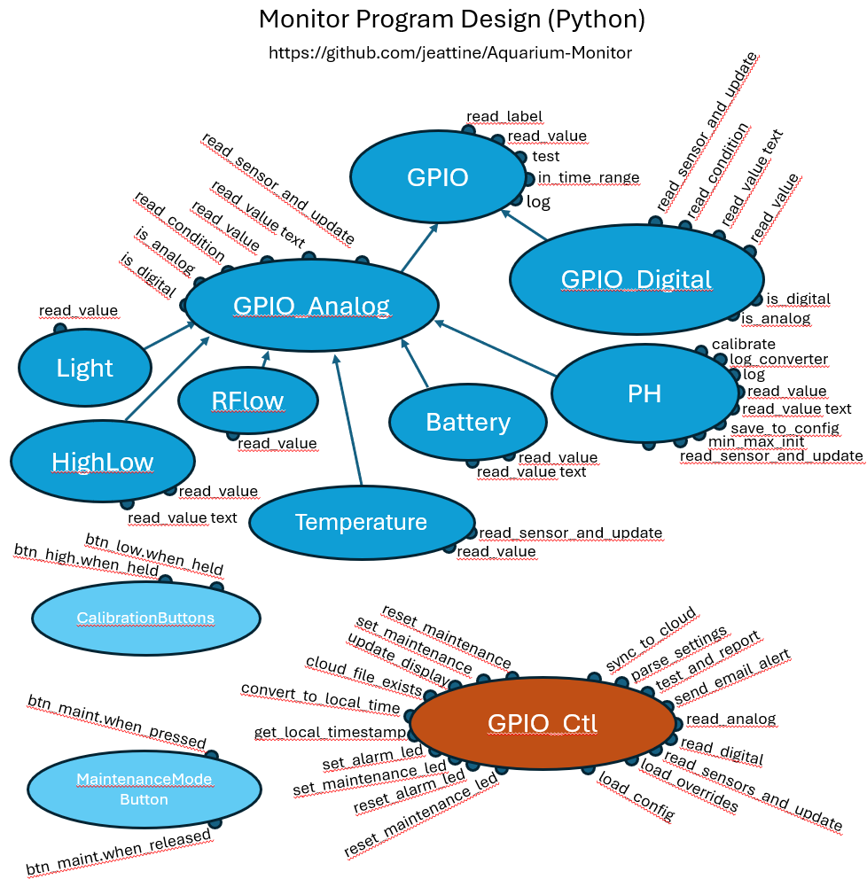

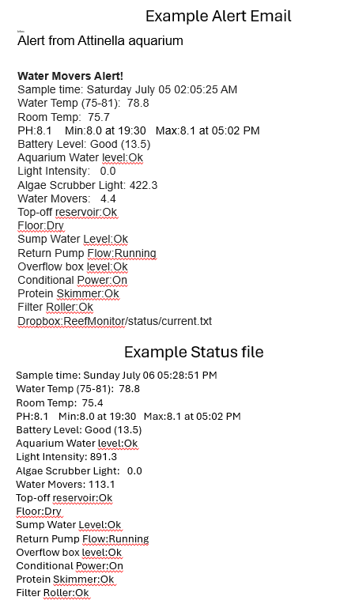

This is the bigger picture, showing the network interfaces and wiring to the various sensors:
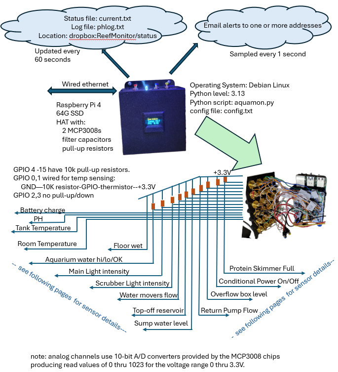

The Raspberry Pi board, Perma-Proto Hat with the two MCP3008 ICs, and the wiring to the RCA inputs:

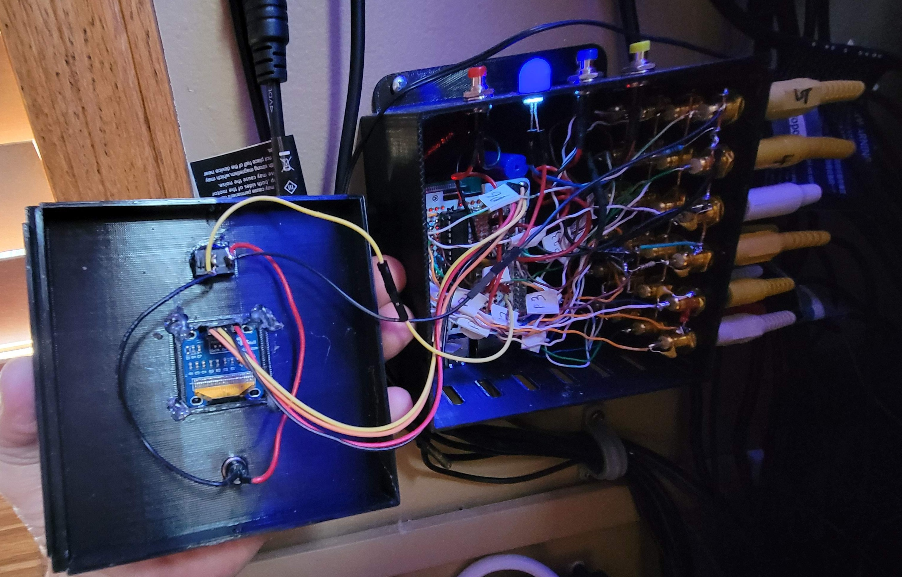

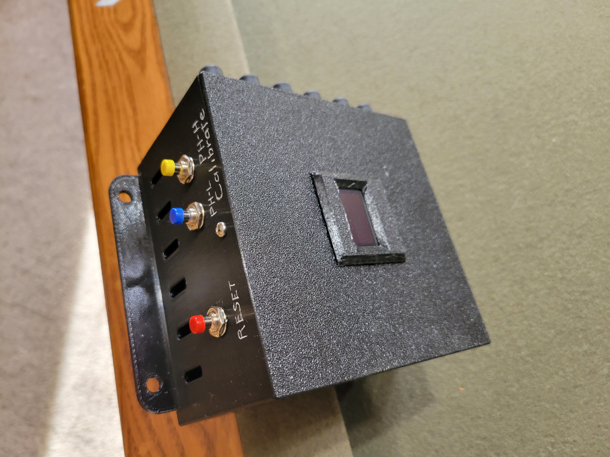

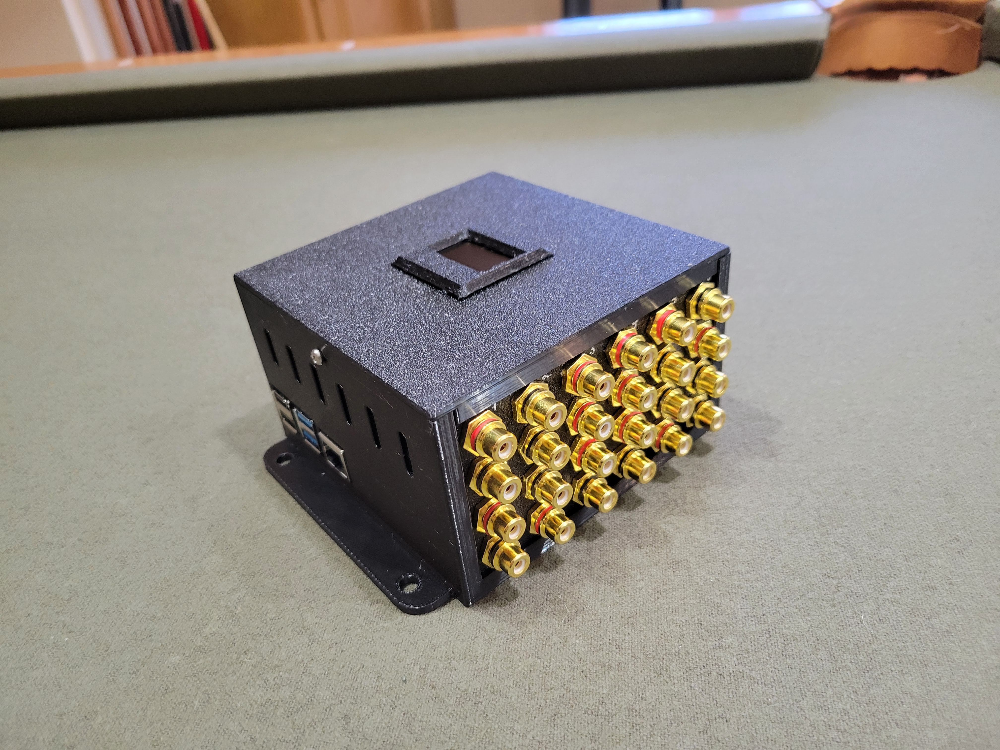

Internal wiring schematic:

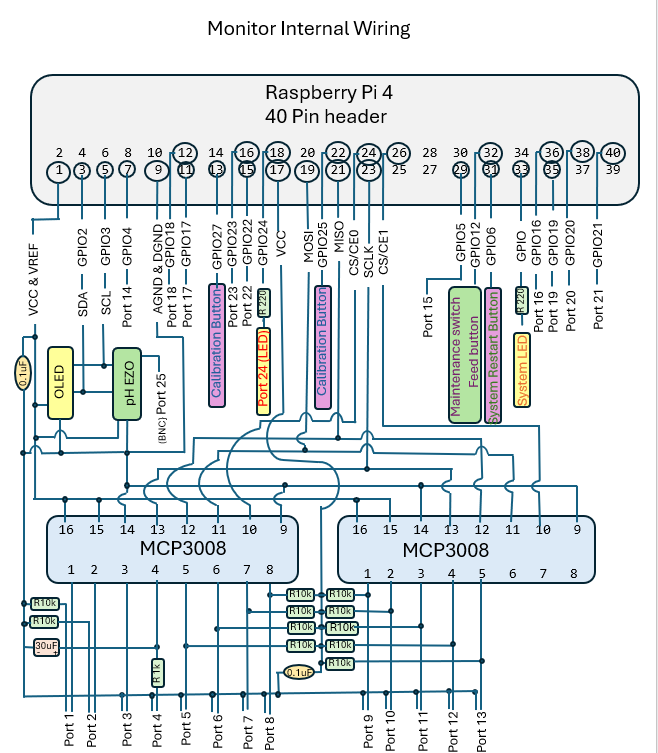

The following images show the various sensors that feed the monitor through the RCA ports:
  
***
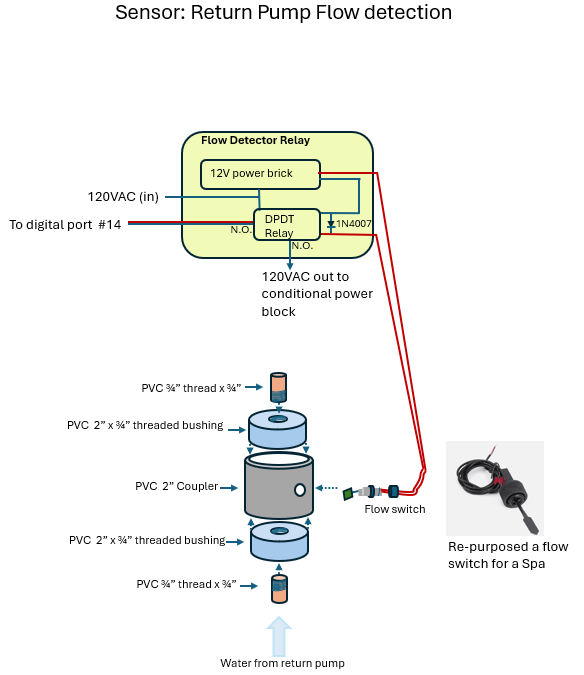
  
***
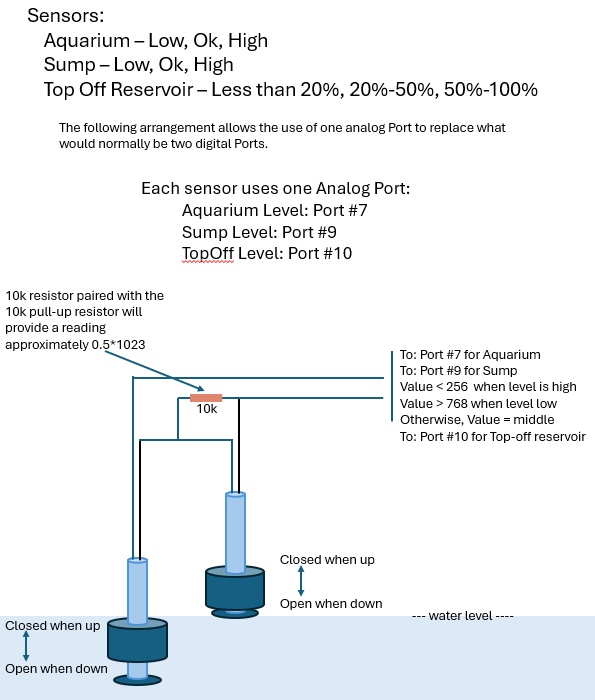
  
***
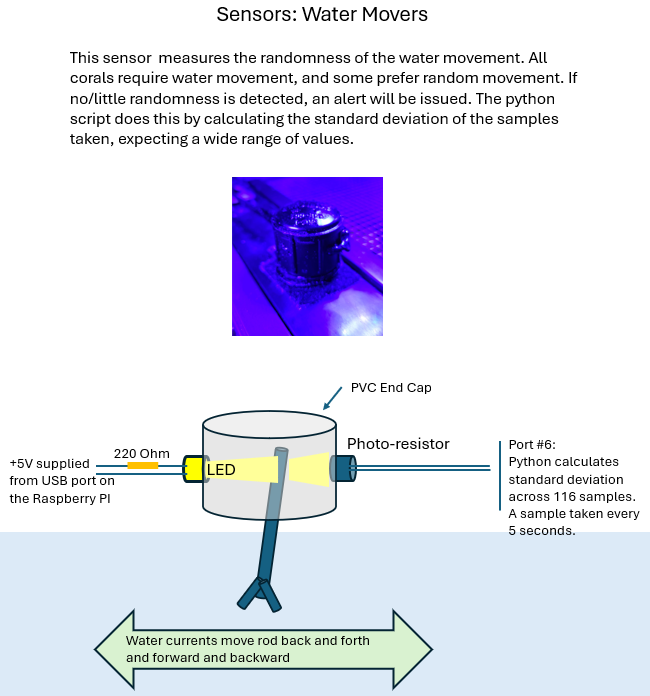
  
***
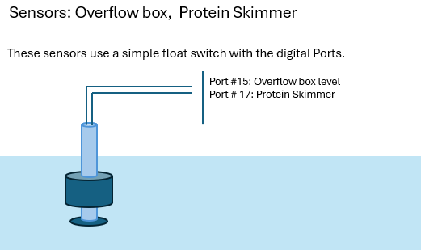
  
***
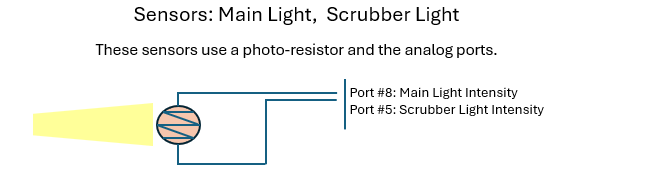
  
***
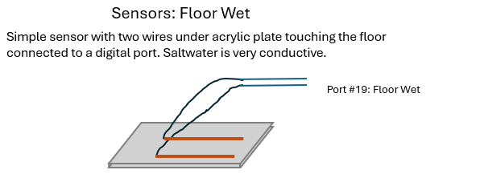
  
***
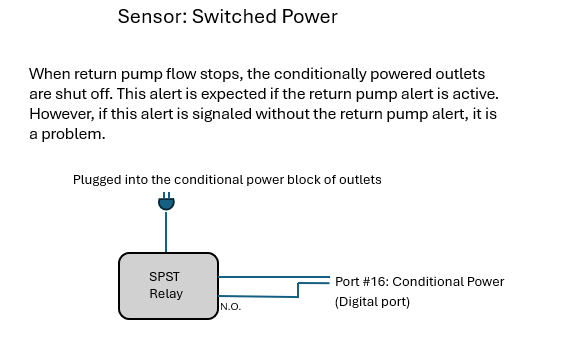
  
***
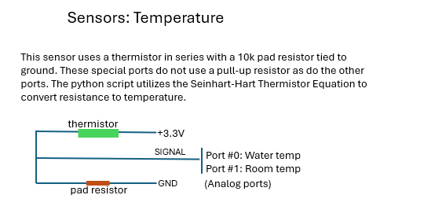
  
***
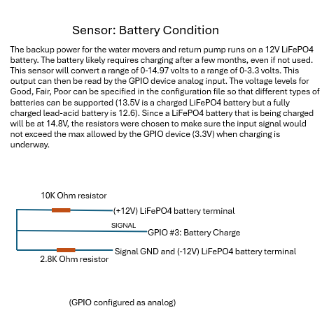
  
***
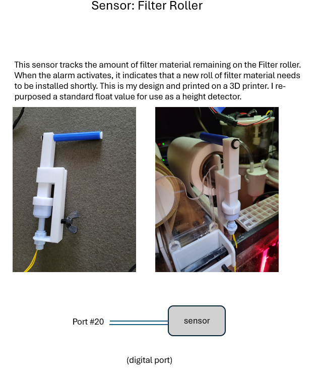
  
***
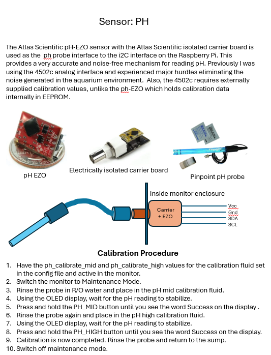
***


## Raspberry Pi Setup for the Aquarium Monitor

### Flash the OS

1.  Download the **Raspberry Pi Imager** on your Windows 11 machine.
2.  Select **OS**: _Raspberry Pi OS (64-bit) Lite_ (You don't need a desktop GUI).
3.  Select **Storage**: Your microSD card.
4.  **Gear Icon (Edit Settings)**:
    *   **Set hostname:** e.g., aquamon-local
    *   **Set username/password:** (e.g., pi and your chosen password).
    *   **Configure Wireless LAN:** Enter your SSID and Password.
    *   **Services Tab:** Check **Enable SSH** and use password authentication.
5.  Click **Write**.

### Connect via SSH

Once the card is flashed, pop it into the Pi and power it up. Wait about 2 minutes for the first boot.

1.  Open **PowerShell** on Windows 11.
2.  Type:
    ```
	ssh pi@aquamon.local
	```
	(replace pi and aquamon with the credentials you set).
3.  If it asks about "authenticity of host," type:
    ```
	yes
	```
4.  Enter your password. You are now "inside" the Pi.
5.  Finish and Reboot:
    ```
	sudo reboot
    ```	
	(You'll be disconnected; wait a minute and SSH back in).

### Environment Setup and Libraries

Modern Raspberry Pi OS (Bookworm) requires a **Virtual Environment (venv)** to prevent breaking system-wide packages.

### Update the system

```
sudo apt update sudo apt upgrade -y  
sudo apt install python3-dev -y  
sudo apt install i2c-tools -y  
sudo apt install rclone  
sudo apt install swig liblgpio-dev python3-dev build-essential -y  
sudo apt-get install fonts-freefont-ttf  
curl -fsSL https://tailscale.com/install.sh | sh  
sudo tailscale up  
```

### Create a project folder

```
mkdir reef_monitor && cd reef_monitor
```

### Create and activate a Virtual Environment

```shell
python -m venv env
source env/bin/activate
```

### Install the necessary python libraries

```shell
pip install gpiozero spidev luma.oled smbus2 rpi-lgpio sdnotify  
```

### Enable Hardware Interfaces

The design uses **SPI** (for the MCP3008s) and **I2C** (for the OLED). These are disabled by default.  
1.  In the SSH terminal:
    ```shell
	sudo raspi-config
	```
1.  Navigate to **Interface Options**.
1.  Enable **I2C** and **SPI**.

### Transfer the code

Since we are on Windows, the easiest way to move your .py and config.txt files to the Pi is using **SCP** (Secure Copy). Open a _new_ PowerShell window on your Windows desktop (not the one logged into the Pi) and run:  

```shell
scp aquarium_script.py config.txt pi@aquamon.local:~/reef_monitor/
```

### Set the environment variables and activate environment

The code uses os.environ.get('AQUAMON\_EMAIL'), etc. We need to define these on the Pi so the script can see them.  
1.  In your SSH session, open the profile file:
    ````shell
    nano ~/.bashrc
	````
2.  Scroll to the bottom and add the following:
    ````text
    export AQUAMON_EMAIL=[your_email@gmail.com](mailto:your_email@gmail.com)  
    export AQUAMON_EMAIL_PW="your_app_password"
	````
3.  Source the script:
    ````text
    source ~/reef_monitor/env/bin/activate
	````
4.  Save (**Ctrl+O, Enter**) and Exit (**Ctrl+X**).
5.  Refresh the variables:
    ```shell 
    source ~/.bashrc
	```

### Run and Automate

To test it: 

```shell 
python reef_monitor/aquarium_script.py
```
### Setup a systemd service to have it start on boot

In the SSH session, run the following command to create a new service file:

```shell
sudo nano /etc/systemd/system/reef_monitor.service
```
Service file:  
```text
[Unit]  
Description=Reef Aquarium Monitor Script  
After=network-online.target  
Wants=network-online.target  

[Service]
Type=notify  
User=aquamon  
# Add Environment variable here  
Environment="AQUAMON_EMAIL=aquamonemail@gmail.com"  
Environment="AQUAMON_EMAIL_PW=abcdefghijklmnop"  
# Path to your python interpreter and your script  
ExecStart=/home/aquamon/reef_monitor/env/bin/python3 -u /home/aquamon/reef_monitor/aquamon.py  
# Working directory (helps if your script loads fonts or images from its own folder)  
WorkingDirectory=/home/aquamon/reef_monitor  
# Restart logic  
Restart=always  
# Wait 10 seconds before restarting to prevent rapid-fire loops  
RestartSec=10s
WatchdogSec=180  

[Install]  
WantedBy=multi-user.target  
```

During developement/debug I would typically stop the service and run the the monitor in an ssh'ed terminal session. 

You must then enable the service. This creates a symlink (a shortcut) that tells the system to run this script when it reaches multi-user.target (normal bootup).  
```shell
sudo systemctl enable reef_monitor.service  
```
I also have a reef shutdown service that runs separately to provide restart and shutdown via buttons. This would done as a separate service so that if the monitor ends or is hung, the restart and shutdown button actions would still be active.

```shell
sudo nano /etc/systemd/system/reef_shutdown.service  
```

```text
[Unit]  
Description=Reef Monitor Hardware Shutdown Button  
After=network.target

[Service]  
Type=simple  
ExecStart=/usr/bin/python3 /home/aquamon/reef_monitor/shutdown_button.py  
Restart=always  
RestartSec=5  
User=root

[Install]  
WantedBy=multi-user.target  
```

Also enable this service:
```shell
sudo systemctl enable shutdown.service  
```

### Install Rclone

The command rclone copy is **one-way only**. It behaves like an "upload" or a "download". It will **not** try to synchronize with all files in the cloud folder.

*   Run rclone config on Raspberry Pi.
*   Name it dropbox, pick the dropbox number.
*   When it asks **"Use auto config?"**, type **n** (No).
*   Copy the command given (e.g., rclone authorize "dropbox") and run it on your Windows PC.
*   Log in to Dropbox in your browser, click **Allow**, and paste the resulting token back into the Pi.

### Setup aliases

```shell
nano ~/.bash_aliases  
```

```text
alias update-aquamon='rclone copyto dropbox:GitHub/Aquarium-Monitor/aquamon.py ~/reef_monitor/aquamon.py && echo "aquamon.py updated from local repo"'
alias update-config='rclone copyto dropbox:GitHub/Aquarium-Monitor/config.txt ~/reef_monitor/config.txt && echo "config.txt updated from local repo"'
alias monitor-logs='TZ="America/Chicago" journalctl -u reef_monitor.service --no-pager -n 40'
```

The update-\* aliases make code testing convenient. SSH to the system from your device, and assuming your device has dropbox access to the local repository directory, run the scripts to update the code and configuration files as needed.

## Managing the Monitor  

When the monitor is up and running via the reef_monitor service, use these commands to work with it:

| Task | Command |
| --- | --- |
| Check if it's running | sudo systemctl status reef\_monitor.service |
| Stop the monitor | sudo systemctl stop reef\_monitor.service |
| Restart monitor | sudo systemctl restart reef\_monitor.service |
| View past logs | monitor-logs |
| View live logs | sudo journalctl -u reef_monitor.service -f |
| Update monitor code | update-aquamon |
| Update config file | update-config |


## Monitor Enclosure

The enclosure and related parts were all printed on a 3D printer. I have included the FreeCad source files for these parts. They can be modified with FreeCad and/or exported to 3mf files for printing.  

***

# The Big Picture

The following diagrams depict my overall aquarium environment. The first diagram shows the interconnections of pumps, filters, lights, scrubber, monitor, etc.. The second diagram shows the management and plumbing of both saltwater and R/O water.  

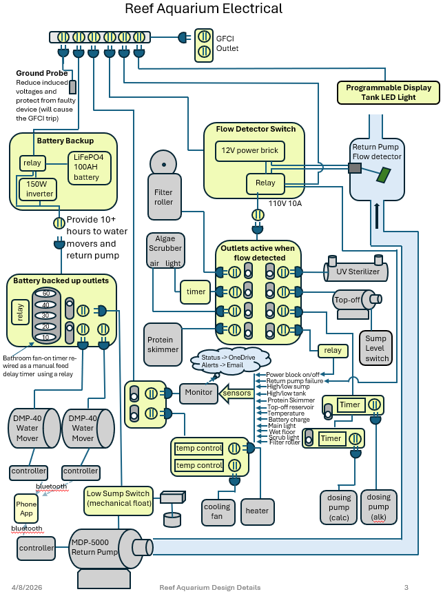  

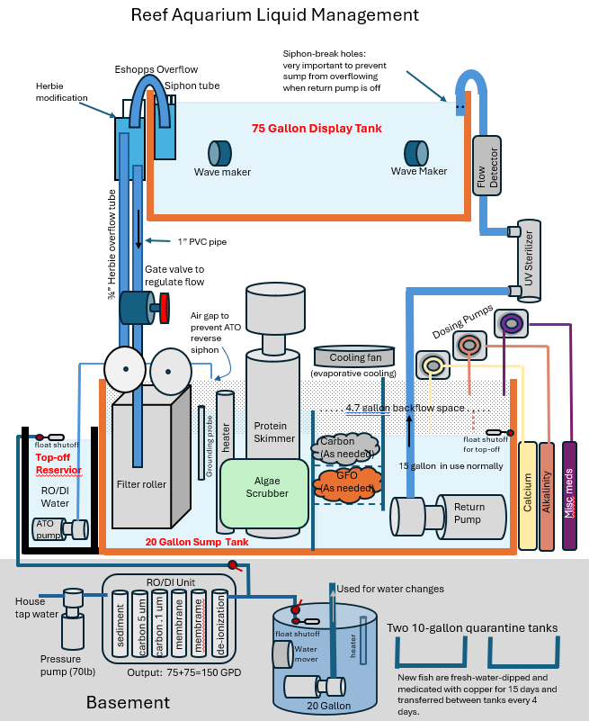

# License Information

This project is licensed under the MIT License, except for the /Print3D folder, which is licensed under CC BY-NC 4.0.

